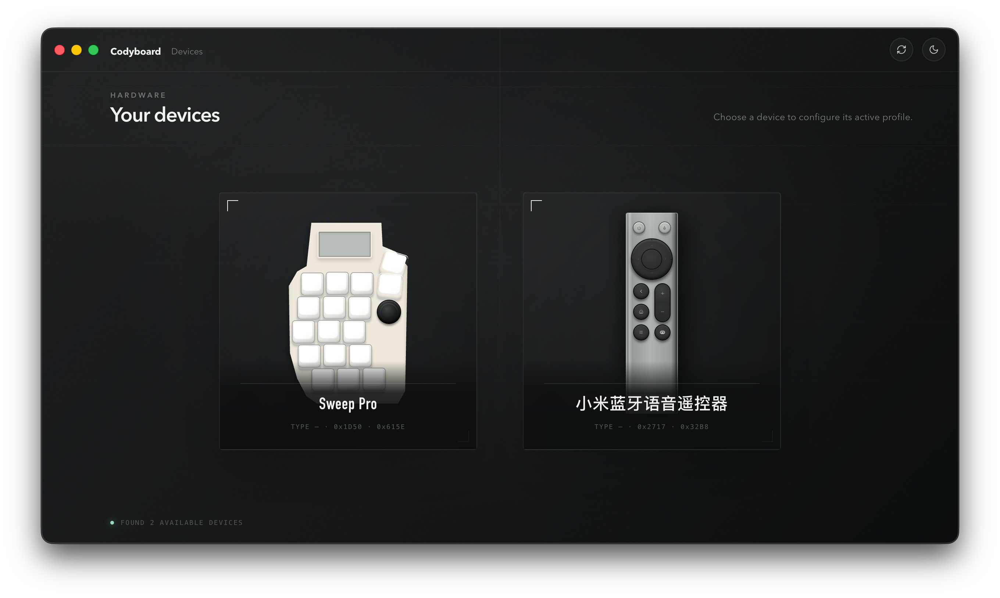
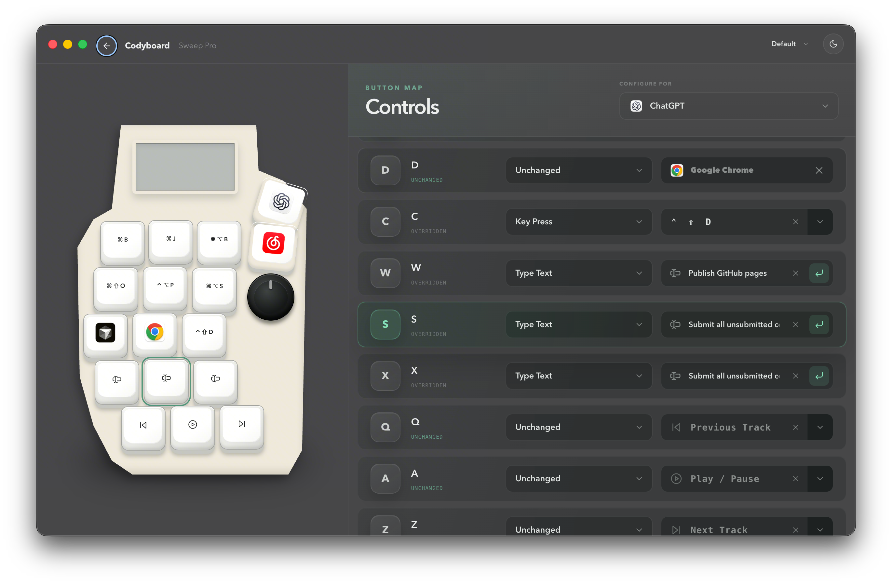

# Codyboard Desktop

Turn a supported macropad or remote into an application-aware control surface for macOS.

[](https://github.com/MagicCube/codyboard-desktop/releases/latest)


Codyboard detects supported physical HID devices, lets you assign actions to every control, and switches mappings for the application you are using. Keyboard capture and event synthesis run in a native Swift daemon, while the settings experience is built with Electron and React.

## Highlights

- Configure mappings per physical device instead of relying on keyboard type alone.
- Add application-specific overrides while keeping a global fallback.
- Send key combinations, media controls, and system actions.
- Launch applications or open URLs from a device button.
- Type Unicode text—including Chinese and English—without using the clipboard.
- Optionally press Enter after a text action.
- Create and switch between reusable profiles.
- Open **Get Funky 🪩** from the menu bar and make a quantized loop with the on-screen or physical Sweep Pro.
- Keep capture active while Get Funky is minimized or behind other apps; closing its window stops playback and releases the keyboard.
- Store configuration locally as readable YAML files.

## Screenshots

### Connected devices



### Application-aware button mappings



## Get Funky 🪩

Choose **Get Funky 🪩** from the menu bar to open the built-in loop instrument. It starts immediately—there is no welcome screen or keyboard command to begin—and the on-screen Sweep Pro works even when no hardware is connected.
Closing the window exits the instrument immediately: playback stops and an exclusively captured Sweep Pro is released. Minimizing the window or placing it behind another app keeps the loop running.

The 15 pads are a performance grid. Rows are five ways of playing a chord — a comped stab, a strummed spread, a decomposition arpeggio, a root pedal under moving upper tones, and a pentatonic lead riff — and the three columns are the roots `i7`, `IV9`, and `VI`. So a sideways move changes chord while the texture holds, and a vertical move changes texture while the chord holds. Everything is quantized and locked to the key, so any combination stays in tune. The four most recent pads loop as a two-bar progression.

Hold or tap **Shift** to reach the second layer on the same 15 pads:

| Shifted column | What it does |
| --- | --- |
| Left | Switch the rig — CLAV77, HORNS, RHODES, MOOG or NEON. One press swaps every instrument, the groove and the key on the spot, restarting the loop from the top. |
| Middle | Jump to a drum style — FUNK, DISCO, HOUSE, HIPHOP or GLOBAL. Press again to walk that style's kits. |
| Right | Fire a performance effect — FILTER, DROP, HALF, DBL or RISER. |

Tab plays or pauses, Shift + Tab clears the loop, and holding Tab for three seconds resets everything back to the opening state. Pressing the knob cycles the rig, drum, bass and tempo layers; turning it browses 5 rigs, 16 drum kits and 16 bass patterns, or moves tempo from 60–180 BPM.

When a physical Sweep Pro is connected, Codyboard temporarily gives the instrument exclusive control of its buttons. While Get Funky is open, all Codyboard profile mappings—global and application-specific, across every device—are suspended. Other keyboards retain their original unmapped behavior, and the saved profiles resume unchanged when you leave the page.

## Supported hardware

| Device | USB vendor ID | Product ID |
| --- | ---: | ---: |
| Sweep Pro | `0x1D50` | `0x615E` |
| 小米蓝牙语音遥控器 | `0x2717` | `0x32B8` |

Device detection uses exact vendor and product identifiers. Virtual keyboards are excluded from normal discovery.

## Requirements

- macOS 14 or later
- Apple Silicon for the prebuilt release package
- Accessibility permission
- Input Monitoring permission

Accessibility allows Codyboard to send mapped shortcuts and text. Input Monitoring allows it to read device-only controls such as Power and Back. Permission state is read directly from macOS, and input data stays on the Mac.

The virtual **Get Funky 🪩** instrument does not require either permission. Permissions are only needed to play it from a physical Sweep Pro.

## Install

1. Download the latest Apple Silicon archive from [GitHub Releases](https://github.com/MagicCube/codyboard-desktop/releases/latest).
2. Unzip it and move `Codyboard.app` to `/Applications`.
3. Open Codyboard and grant Accessibility and Input Monitoring when prompted.
4. Connect a supported device and choose it from the device screen.

The current release is ad-hoc signed rather than notarized. If macOS blocks the first launch, open **System Settings → Privacy & Security** and choose **Open Anyway** for Codyboard.

## Build from source

You will need:

- Node.js
- [`pnpm`](https://pnpm.io/)
- Xcode with the macOS SDK and Swift toolchain

```bash
git clone https://github.com/MagicCube/codyboard-desktop.git
cd codyboard-desktop
pnpm install
pnpm dev
```

Create a production build:

```bash
pnpm build
```

Package an Apple Silicon macOS application:

```bash
pnpm package:mac
```

The packaged application is written to `release/Codyboard.app`.

## Development

| Command | Purpose |
| --- | --- |
| `pnpm dev` | Build native and Electron code, then start the development app |
| `pnpm lint` | Run ESLint with typed rules |
| `pnpm typecheck` | Check TypeScript without emitting files |
| `pnpm test` | Run the TypeScript test suite |
| `pnpm test:native` | Run the Swift test suite |
| `pnpm build` | Build the native daemon, Electron process, and renderer |
| `pnpm package:mac` | Build and package the arm64 macOS application |

Before submitting a change, run:

```bash
pnpm lint
pnpm test
pnpm test:native
pnpm build
```

## Architecture

- **Renderer:** React, TypeScript, Vite, Tailwind CSS, and shadcn-style Radix components.
- **Desktop shell:** Electron main process, preload bridge, tray lifecycle, and profile coordination.
- **Native input:** the long-running Swift `CodyboardDaemon` captures HID and keyboard events and posts mapped output through macOS APIs.
- **Persistence:** Electron validates and compiles YAML profiles, then atomically replaces the daemon snapshot.

The native Event Tap hot path does not read files or perform cross-process lookups. Application and profile policy stays in the Electron main process, outside the transport client and visual components.

## Configuration

Codyboard keeps user configuration under `~/.codyboard/`:

```text
~/.codyboard/
├── settings.yaml
└── profiles/
    └── hid-{type}/
        └── {profile-id}.yaml
```

`settings.yaml` records the active profile. Each profile is stored separately and can contain global mappings plus application-specific overrides.

## Contributing

Issues and pull requests are welcome. Please keep platform behavior in the appropriate layer, add tests for domain changes, and include before/after screenshots for visible UI work.

This repository does not currently include an open-source license file. A license must be added before third parties can legally redistribute modified versions.
